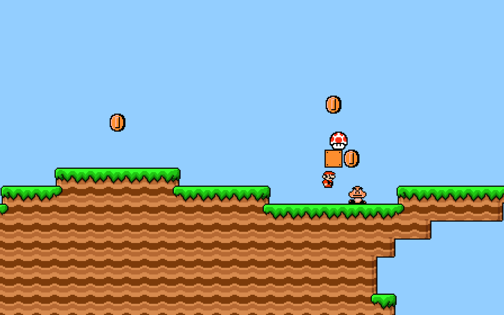
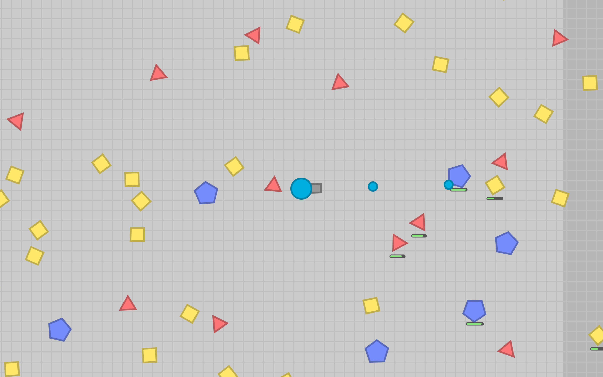
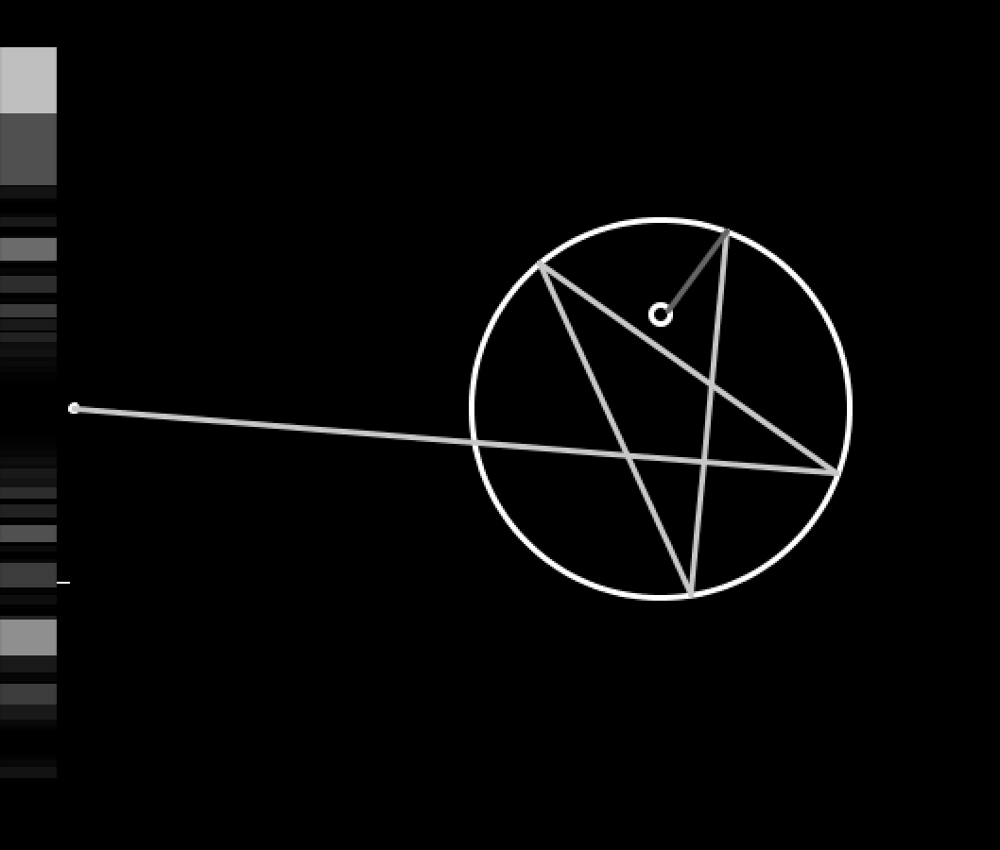
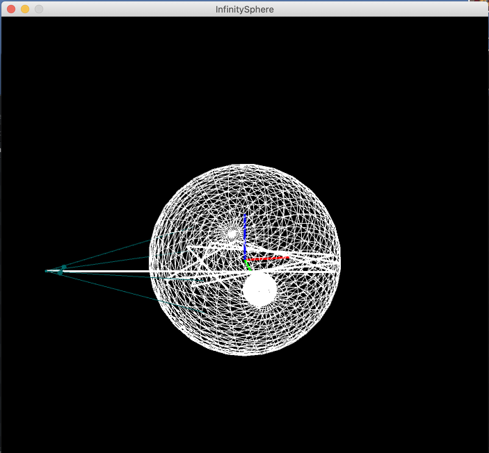
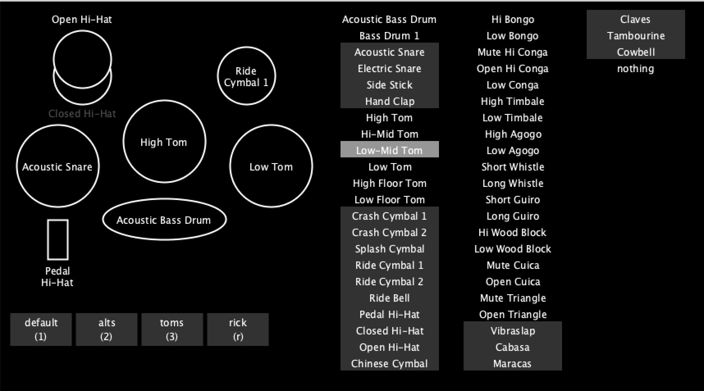

# processing-projects
This is a dump of some of my more interesting projects I've coded in Processing. <a href=http://https://processing.org/>Processing</a> uses the Java language but has a simple IDE and built in graphical libraries and mathematical functions that makes prototyping much quicker and easier.

A partial implementation of "mario" I wrote. The terrain is controlled by a text file.
   

<a href = "https://chinmaymurthy474.wixsite.com/portfolio/diep-io-recreation">A partial copy of an online "io game": diep.io</a>
   

The 2-dimensional predecessor to my Infinity Sphere project (next)
   

<a href = "https://chinmaymurthy474.wixsite.com/portfolio/custom-infinity-sphere">Infinity Sphere</a>. It renders out an image of what a spherical light source on the inside of a partially internally reflective sphere would look like from the outside. (what's shown is the preview of the 3d scene the program displays live; some renders can be found within the file structure)
   

The user interface that goes along with my <a href = "https://chinmaymurthy474.wixsite.com/portfolio/guitar-hero-drum-hacking">MIDI-enabled Guitar Hero drum kit</a>.
   
